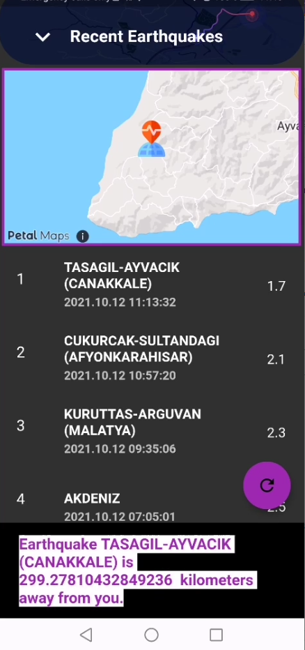
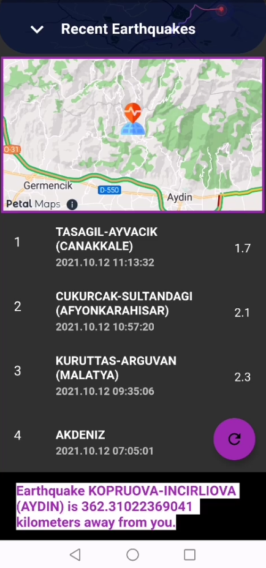

# Earthquake App 

This application allows the distance difference between the region where earthquakes occurred and the user to be displayed both on the huawei map and by calculating the kilometer separately.

## Which Packages Will We Use?

You'll learn how to create a earthquake app that includes the Huawei Map Kit and Location Kit using the Flutter SDK.

```
  http: ^0.13.3
  huawei_map: ^6.0.1+304
  huawei_location: ^6.0.0+302
  cupertino_icons: ^1.0.3
```
- 

- 

If you want more, you can read Medium article.

- [Earthquake Application With Huawei Map and Location Kits](https://medium.com/huawei-developers/earthquake-application-with-huawei-map-and-location-kits-37fca409ed07)

